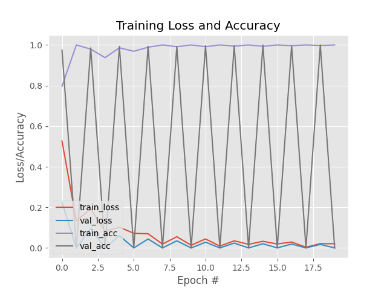

```markdown
# Face Mask Detection using Deep Learning 🎭

This project demonstrates a deep learning approach to detect face masks in real-time using OpenCV and TensorFlow/Keras. It consists of two main components:
- **Training** a MobileNetV2-based model to classify images with/without masks.
- **Real-time detection** using a webcam and the trained model.

---

## 📂 Project Structure

```
├── detect_mask_video.py       # Real-time detection using webcam 

├── train_mask_detector.py     # Script to train the mask detection model

├── mask_detector.h5           # Trained model file

├── plot.png                   # Training loss and accuracy plot

└── README.md                  # Project documentation

```

---

## 🔧 Installation

1. Clone the repository:
```bash
git clone https://github.com/yourusername/face-mask-detector.git
cd face-mask-detector
```

2. Install the required packages:
```bash
pip install -r requirements.txt
```

3. Prepare the dataset:
Ensure your dataset directory is structured like this:
```
dataset/
├── with_mask/
└── without_mask/
```

---

## 🚀 Usage

### 1. Train the Model

```bash
python train_mask_detector.py
```

This will:
- Load and preprocess the dataset.
- Train a model using MobileNetV2.
- Save the trained model to `mask_detector.h5`.
- Generate a training plot as `plot.png`.

### 2. Real-Time Detection

```bash
python detect_mask_video.py
```

This will:
- Load the trained model.
- Use OpenCV to access your webcam.
- Display the live video stream with mask/no-mask predictions.

---

## 📈 Sample Output



---

## 🧰 Requirements

- tensorflow
- keras
- opencv-python
- imutils
- numpy
- scikit-learn
- matplotlib


---

## ✍️ Author

Developed by Rohan Vayase
